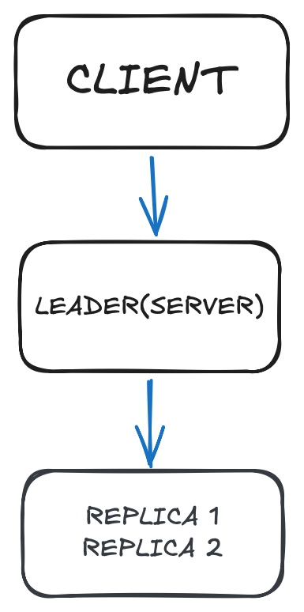

# 🚀 Distributed Key-Value Store (Leader-Based Replication)

A simplified distributed key-value store implementing a **leader-replica architecture**, built using Python and REST APIs.

---

## 📌 Overview

This project simulates a distributed system where:

* A **leader node** handles all write operations
* **Replica nodes** receive updates for consistency
* Clients interact with the system via HTTP APIs

---

## 🧠 System Design

```
Client → Leader Node → Replica Nodes
```
## 🏗️ Architecture Diagram



* Client sends requests (PUT/GET)
* Leader processes writes
* Leader replicates data to followers
* Followers store replicated data

---

## ⚙️ Tech Stack

* Python
* Flask (REST API)
* Requests (HTTP client)

---

## 🔑 Features

* Leader-based write handling
* Data replication to follower nodes
* RESTful API endpoints
* Fault-tolerant design (basic simulation)

---

## 📡 API Endpoints

### ➤ PUT (Store Data)

```
POST /put
{
  "key": "name",
  "value": "leela"
}
```

### ➤ GET (Retrieve Data)

```
GET /get/<key>
```

---

## ▶️ How to Run

### 1. Install dependencies

```
pip install flask requests
```

### 2. Start server

```
python3 src/server.py
```

### 3. Run client

```
python3 src/client.py
```

---

## 📊 Example Output

```
PUT: 200 {"status":"ok"}
GET: 200 {"value":"leela"}
```

---

## 🚀 Future Improvements

* Add multiple nodes (true distributed setup)
* Implement Raft consensus algorithm
* Add Docker containerization
* Add persistence (database)

---

## 👤 Author

Leela Prasad Reddy
